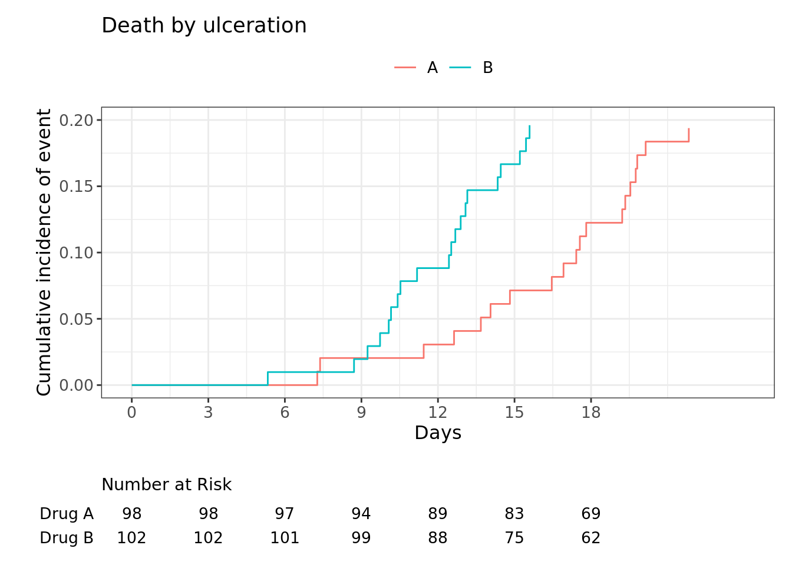

# "ggcuminc" example

## Package

::: cell
``` {.r .cell-code}
#install.packages(c("ggsurvfit", "tidycmprsk"))
library(ggsurvfit)
```

``` {.r .cell-code}
library(tidycmprsk) ## for cuminc function
```

## example data : tt

``` {.r .cell-code}
tt <- trial %>% dplyr::mutate(death_cr_int = factor(ifelse(death_cr == "death from cancer", 1, ifelse(death_cr == "censor", 0, 2))))

tt[, c(1,  8, 10, 9)] %>% head(10)
```

| trt    | death_cr           | death_cr_int | ttdeath |
|:-------|:-------------------|:-------------|--------:|
| Drug A | censor             | 0            |   24.00 |
| Drug B | censor             | 0            |   24.00 |
| Drug A | censor             | 0            |   24.00 |
| Drug A | death other causes | 2            |   17.64 |
| Drug A | death other causes | 2            |   16.43 |
| Drug B | death from cancer  | 1            |   15.64 |
| Drug A | censor             | 0            |   24.00 |
| Drug A | death other causes | 2            |   18.43 |
| Drug A | censor             | 0            |   24.00 |
| Drug B | death from cancer  | 1            |   10.53 |


## Run

``` {.r .cell-code}
ci_TVF_PM <- tidycmprsk::cuminc(Surv(ttdeath, death_cr_int) ~ trt, data = tt)

ggcuminc(ci_TVF_PM, outcome = "1") + ylim(0, 0.2) + xlim(0, 20) + xlab("Days") + ylab("Cumulative incidence of event") + ggtitle("Death by ulceration") + theme(legend.position = "top") +
  scale_color_discrete(labels = c("A", "B")) + 
  add_risktable(risktable_stats = c("n.risk"), times = seq(0, 20, by = 3), 
                stats_label = list(n.risk = "Number at Risk")) +
  scale_x_continuous(breaks = seq(0, 20, by = 3))
```


::: cell-output-display
{width="672"}
:::
:::
